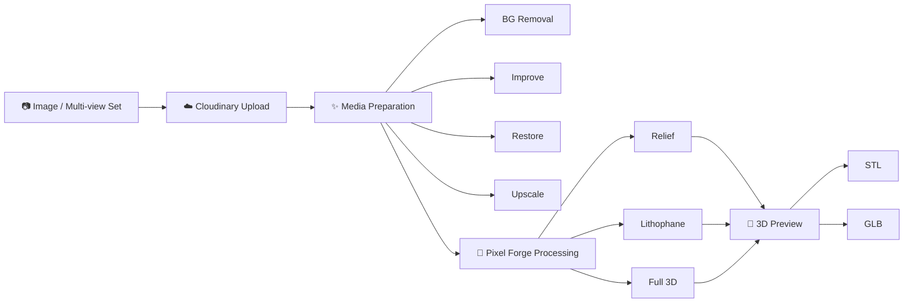

<div align="center">

# ⚒️ PIXEL FORGE

### **Pixels become objects.**

Turn ordinary images into **3D-ready geometry, STL, GLB, reliefs, and lithophanes** through a media-first workflow powered by **Cloudinary**.

[](https://forge-pixel-forge.onrender.com)
[](https://hackindia.org/2026/pixels-to-products-cloudinary-ai-hackathon-2026)
[](https://cloudinary.com/)
[](LICENSE)

**Hackathon Track:** PS-03 · **Your Media-Savvy Startup**

</div>

---

## ✦ The idea

**Images are flat. Ideas are not.**

Creating a usable 3D asset usually means opening Blender or CAD software, learning a complex workflow, cleaning geometry, exporting formats, and repeating the process until the result behaves.

Pixel Forge starts somewhere much simpler:

> **Give it an image. Get something you can shape, inspect, export, and use.**

A product photo can become a relief.  
A portrait can become a lithophane.  
A set of object views can become input for full 3D reconstruction.  
Cloudinary prepares the media before the geometry pipeline ever touches it.

Pixel Forge is designed to make the jump from **2D media → physical/digital form** feel less like a CAD assignment and more like a creative tool.

---

## ☁️ Why Cloudinary is core to Pixel Forge

Cloudinary is not a decorative upload button in this project. It sits directly inside the product's media pipeline.

When a user chooses the Cloudinary workflow, Pixel Forge can:

| Stage | Cloudinary role |
| --- | --- |
| **Upload** | Cloudinary Upload Widget accepts local files, URLs, or camera input |
| **Manage** | Uploaded assets are stored as Cloudinary media assets |
| **Remove background** | `e_background_removal` prepares cleaner object silhouettes |
| **Improve** | `e_improve` enhances the source before reconstruction |
| **Restore** | `e_gen_restore` can restore degraded source imagery |
| **Upscale** | `e_upscale` can increase usable image detail when supported |
| **Optimize delivery** | `q_auto` and `f_auto` create efficient preview delivery |
| **Feed 3D generation** | The transformed Cloudinary asset becomes input to Pixel Forge's geometry / 3D pipeline |

That makes Cloudinary part of the **actual transformation journey**, not merely a place where an image happens to live.

---

## ⚡ The pipeline



### In one line

```text
IMAGE → CLOUDINARY → CLEAN / ENHANCE / OPTIMIZE → GEOMETRY → PREVIEW → STL / GLB
```

---

## ✨ What you can do

### 01 · Upload with Cloudinary
Use the Cloudinary Upload Widget for image ingestion and media management.

### 02 · Prepare the image with Cloudinary media tools
Toggle background removal, image improvement, restoration, or supported 4× upscaling before conversion.

### 03 · Choose how the image becomes form
Pixel Forge supports three creation paths:

| Mode | Best for | Output |
| --- | --- | --- |
| **Relief** | Logos, artwork, plaques, surface geometry | STL / GLB |
| **Lithophane** | Photos and light-based 3D prints | STL / GLB |
| **Full 3D** | Object reconstruction from one or multiple views | Textured GLB + STL |

### 04 · Tune the geometry
Adjust **depth, detail, smoothing, resolution, model type, generation mode, and export format**.

### 05 · Use multi-view reconstruction
Enable **More Accurate 3D** and provide up to **6 views** of an object for a richer reconstruction input.

### 06 · Export something useful
Download **STL** for geometry/3D-print workflows or **GLB** for textured 3D and web experiences.

---

## 🎛️ Product experience

Pixel Forge is intentionally built like a creative instrument rather than a plain upload form.

The interface is organized around one visual idea:

<div align="center">

### **PIXELS → DEPTH → WIREFRAME → MESH → OBJECT**

</div>

The landing experience introduces the transformation visually, while the Studio keeps the tools close to the model: source media on the left, the object in the center, and geometry/export controls on the right.

---

## 🧪 Judge-friendly test flow

Want to understand the project quickly? This is the shortest path:

1. Open the **[live Pixel Forge demo](https://forge-pixel-forge.onrender.com)**.
2. Scroll to **Studio**.
3. Select **Upload with Cloudinary**.
4. Upload a JPG/PNG/WebP image.
5. Confirm the **Original Cloudinary Asset** appears.
6. Toggle **BG Remove**, **Improve**, **Restore**, or **Upscale** where supported.
7. Open **View Preprocessed Image** to see the Cloudinary-generated media result.
8. Pick **Relief**, **Lithophane**, or **Full 3D**.
9. Generate the model.
10. Export **STL** or **GLB**.

> For the clearest hackathon demo, use the Cloudinary upload path rather than the local-file fallback. It exposes the complete media → 3D workflow.

---

## 🧠 How the geometry side works

For relief and lithophane generation, Pixel Forge converts image information into geometry rather than simply wrapping an image around a model.

A simplified relief pipeline looks like this:

```text
Prepared image
      ↓
Resize + normalize
      ↓
Grayscale / intensity map
      ↓
Pixel intensity → height
      ↓
Vertex grid
      ↓
Faces + walls + base
      ↓
Smooth / repair
      ↓
STL / GLB
```

A simplified height relationship is:

```text
height = min_thickness + (brightness / 255) × depth
```

Lithophane mode can invert the relationship so darker regions become thicker and transmit less light.

Full 3D mode follows a separate reconstruction workflow and can accept a single view or a multi-view image set.

---

## 🧰 Tech stack

| Layer | Technology |
| --- | --- |
| **Frontend** | Next.js, React, TypeScript |
| **3D experience** | Three.js, React Three Fiber, Drei |
| **Motion** | Motion, GSAP |
| **Media pipeline** | **Cloudinary Upload Widget + Cloudinary transformations** |
| **Backend API** | FastAPI |
| **Geometry** | NumPy, Pillow, trimesh, SciPy |
| **Image analysis** | Google Gemini integration |
| **3D reconstruction integration** | External 3D reconstruction provider + Pixel Forge job pipeline |
| **Deployment** | Render |

---

## 🌿 Repository layout

The **`main` branch contains the complete hackathon project** so reviewers can inspect the entire implementation from the default GitHub view.

| Path | Contains |
| --- | --- |
| **`app/` + `components/` + `lib/`** | Next.js UI, Studio, Three.js scenes, Motion interactions and Cloudinary integration |
| **`backend/`** | FastAPI API, conversion engine, jobs, exporters, media analysis and 3D services |
| **`.github/workflows/`** | Automated backend checks |

> **Reviewers:** no branch switching is required. The full frontend and backend are available directly on `main`.

---

## 🏃 Run it locally

### Frontend

```bash
git clone https://github.com/utpalchad/pixel_forge.git
cd pixel_forge

cp .env.example .env.local
npm install
npm run dev
```

Configure `.env.local`:

```env
NEXT_PUBLIC_API_URL=http://localhost:8000
NEXT_PUBLIC_CLOUDINARY_CLOUD_NAME=your_cloud_name
NEXT_PUBLIC_CLOUDINARY_UPLOAD_PRESET=your_unsigned_upload_preset
```

For browser uploads, create an **unsigned Cloudinary upload preset** and use its name for `NEXT_PUBLIC_CLOUDINARY_UPLOAD_PRESET`.

### Backend

In a second terminal:

```bash
cd pixel_forge/backend

python -m venv .venv
source .venv/bin/activate
pip install -r requirements.txt

cp .env.example .env
uvicorn app.main:app --reload --port 8000
```

On Windows PowerShell, activate the environment with:

```powershell
.\.venv\Scripts\Activate.ps1
```

Useful backend environment values:

```env
APP_NAME=Pixel Forge API
APP_ENV=development
PUBLIC_BASE_URL=http://localhost:8000
CORS_ORIGINS=http://localhost:3000
MAX_UPLOAD_MB=8
OUTPUT_DIR=outputs

# Optional image analysis
GEMINI_API_KEY=
GEMINI_MODEL=gemini-3.1-flash-lite

# 3D provider configuration
THREEWS_BASE_URL=https://three.ws
THREEWS_DEFAULT_TIER=draft
```

> Never commit Cloudinary secrets, API secrets, or private credentials to the repository.

---

## ✅ Implemented for the hackathon

- [x] Interactive spatial landing experience
- [x] Cloudinary Upload Widget
- [x] Cloudinary asset workflow
- [x] Cloudinary background removal
- [x] Image improvement
- [x] Generative restoration
- [x] Supported image upscaling
- [x] Optimized Cloudinary preview delivery
- [x] Single-image workflow
- [x] Up-to-6-image multi-view workflow
- [x] Relief generation
- [x] Lithophane generation
- [x] STL export
- [x] GLB export
- [x] Full 3D generation workflow
- [x] Fast / Standard generation modes
- [x] Interactive Three.js experience
- [x] Gemini image analysis / prompt enhancement
- [x] Responsive Studio UI
- [x] Live deployment

---

## 🏆 HackIndia · Pixels to Products 2026

Pixel Forge is submitted for:

### **PS-03 · Your Media-Savvy Startup**

The track asks for a startup-style product where media is central to the user experience and Cloudinary performs meaningful work managing, transforming, optimizing, or delivering that media.

That is the product loop Pixel Forge is built around:

> **Cloudinary prepares the pixels. Pixel Forge turns them into form.**

---

## 🔭 Where Pixel Forge can go next

The hackathon build focuses on proving the media-to-geometry workflow. Natural extensions include:

- Saved projects and version history
- Model comparison between source views
- Automatic view-quality scoring
- Richer texture reconstruction
- Cloudinary metadata/tag-driven asset organization
- Printability analysis and mesh diagnostics
- Direct handoff to fabrication / 3D-print services
- Collaborative project workspaces

---

## 📜 License

Pixel Forge is released under the **MIT License**. See [LICENSE](LICENSE).

---

<div align="center">

### **PIXEL FORGE**

**From image to geometry. From pixels to form.**

[Live Demo](https://forge-pixel-forge.onrender.com) · [Main Repository](https://github.com/utpalchad/pixel_forge) · [Backend](https://github.com/utpalchad/pixel_forge/tree/main/backend)

</div>
